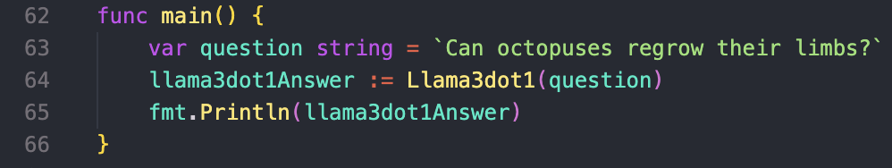

# LLAMA-3.1 Implementation with GO

This is a simple terminal-based project that uses LLAMA-3.1 as LLM to answer any question you may have. 

## Installing LLAMA-3.1 🦙

1. First of all, install Ollama [here](https://ollama.com/)

2. Go to `localhost:11434` and check if Ollama is running.

3. Then, install LLAMA-3.1 by running: 

        ollama run llama3.1

## Run the program

1. Change the query on `ln.63` for the one you like to ask.
    

2. Run the program:

        go run main.go

